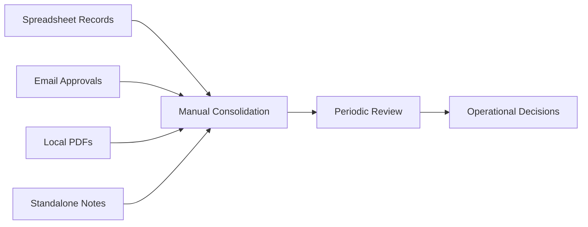
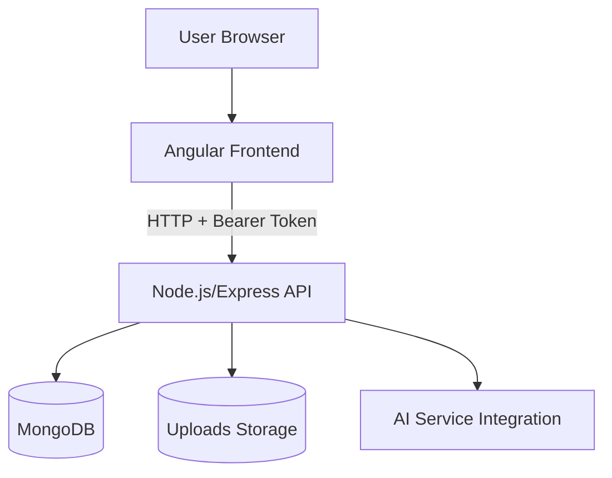
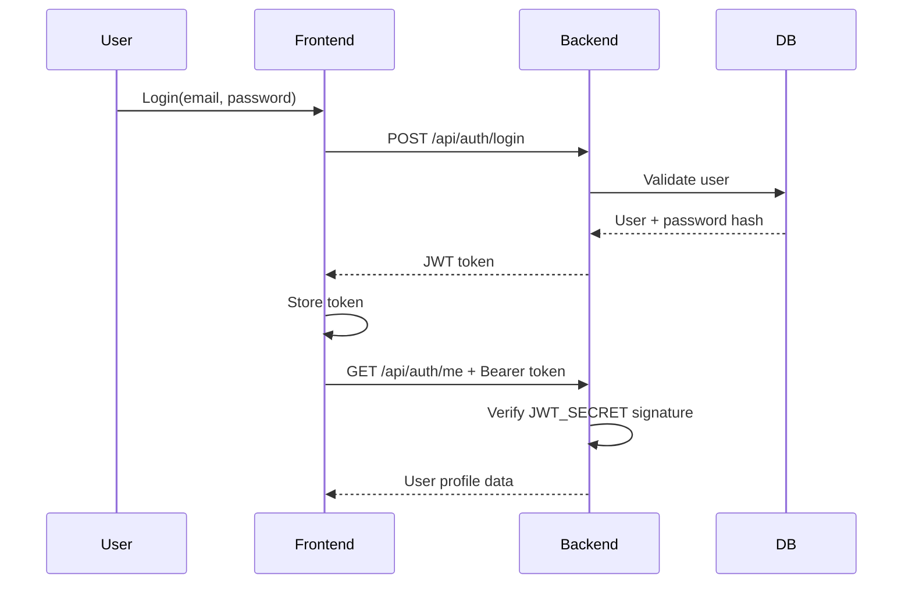
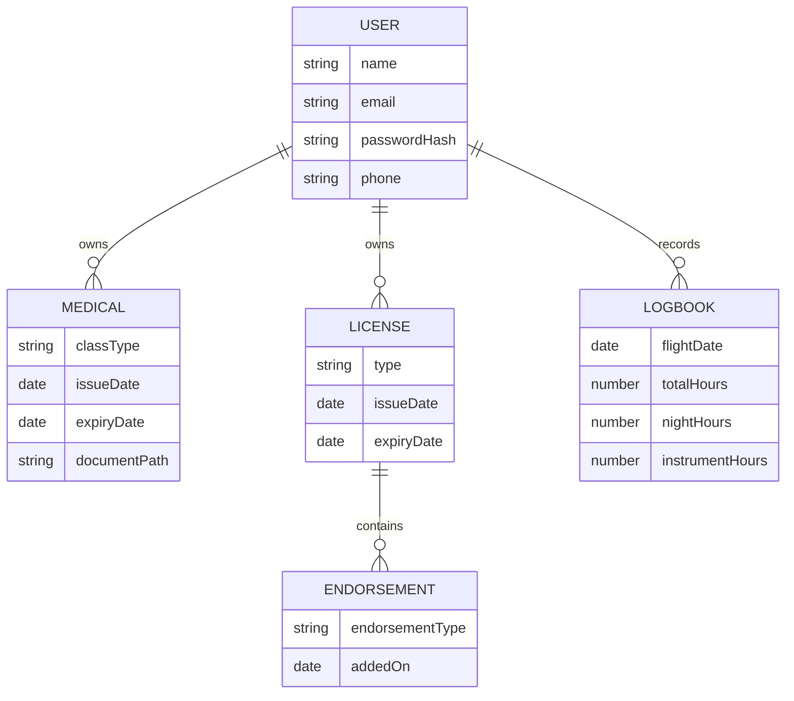
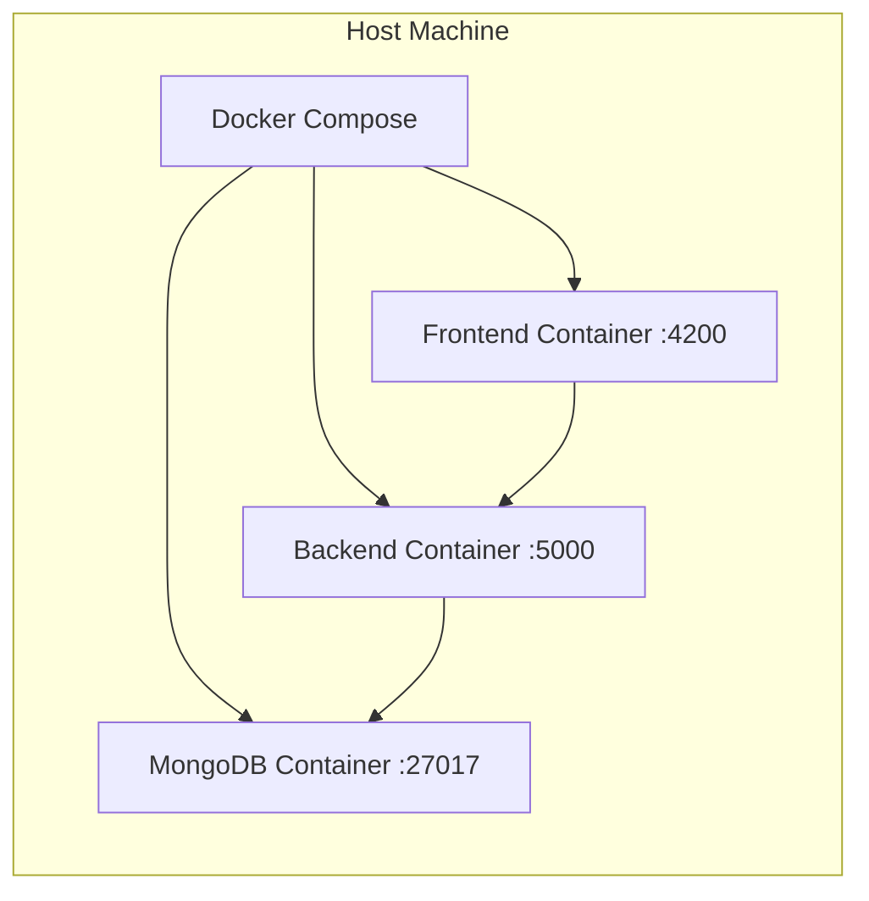
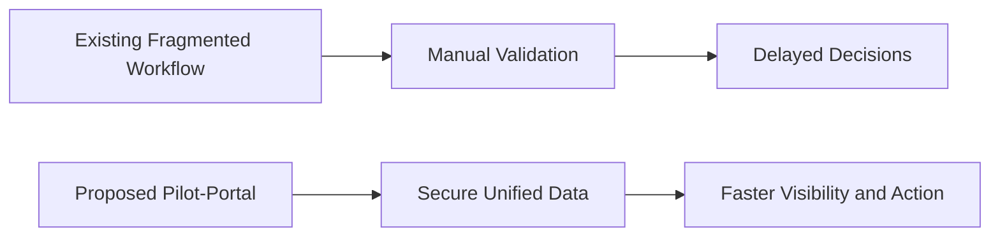
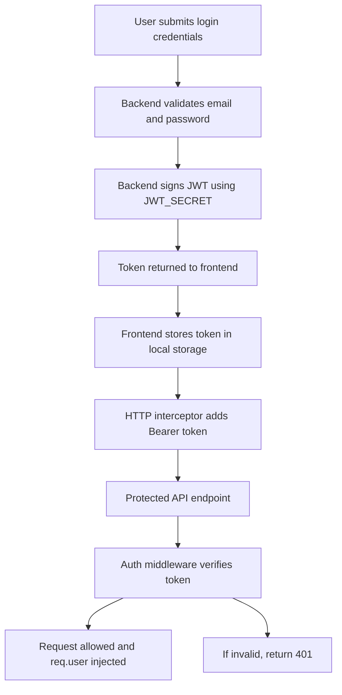
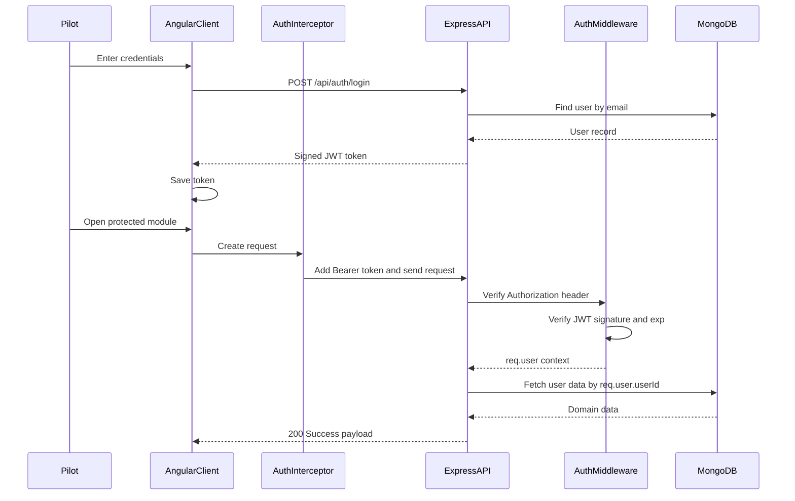

# Pilot-Portal Application
## Comprehensive Project Report

**Program:** Software Engineering Major Project  
**Project Title:** Pilot-Portal: Digital Pilot Operations and Currency Management Platform  
**Project Type:** Full-Stack Web Application with Secure Token-Based Authorization  
**Prepared On:** 10 March 2026

---

## 1. List of Tables

| Table No. | Title | Page* |
|---|---|---|
| Table 1.1 | Abbreviation Dictionary | TBD |
| Table 4.1 | Project Objectives and Measurable Outcomes | TBD |
| Table 4.2 | Stakeholder Matrix | TBD |
| Table 5.1 | Literature Comparison of Aviation Record Systems | TBD |
| Table 5.2 | Feature Gap Matrix Across Existing Platforms | TBD |
| Table 6.1 | Existing System Limitation Analysis | TBD |
| Table 6.2 | Risk Register for Existing Workflow | TBD |
| Table 7.1 | Proposed Module-Wise Functional Scope | TBD |
| Table 7.2 | API Endpoint Catalog | TBD |
| Table 7.3 | Security Control Matrix | TBD |
| Table 8.1 | Software Stack and Versions | TBD |
| Table 8.2 | Frontend Libraries and Usage | TBD |
| Table 8.3 | Backend Dependencies and Usage | TBD |
| Table 9.1 | Functional Test Summary | TBD |
| Table 9.2 | Security and Authorization Test Cases | TBD |
| Table 9.3 | Build and Deployment Validation Results | TBD |
| Table 9.4 | Performance Snapshot | TBD |
| Table 10.1 | Lessons Learned | TBD |
| Table 10.2 | Future Enhancement Roadmap | TBD |

*Page numbers can be auto-generated after export to DOCX/PDF.

---

## 2. List of Figures

| Figure No. | Title | Page* |
|---|---|---|
| Figure 2.1 | High-Level System Architecture | TBD |
| Figure 2.2 | User Authentication and Authorization Flow | TBD |
| Figure 2.3 | Pilot Lifecycle Data Flow | TBD |
| Figure 2.4 | Existing vs Proposed Operational Model | TBD |
| Figure 2.5 | Route Protection and JWT Validation Sequence | TBD |
| Figure 2.6 | Deployment Topology (Docker Compose) | TBD |
| Figure 2.7 | Data Relationship Overview | TBD |
| Figure 2.8 | Continuous Improvement Loop | TBD |

*Page numbers can be auto-generated after export to DOCX/PDF.

---

## 3. List of Abbreviations

| Abbreviation | Expansion |
|---|---|
| API | Application Programming Interface |
| JWT | JSON Web Token |
| RBAC | Role-Based Access Control |
| UI | User Interface |
| UX | User Experience |
| DB | Database |
| CRUD | Create, Read, Update, Delete |
| HTTP | Hypertext Transfer Protocol |
| TLS | Transport Layer Security |
| CORS | Cross-Origin Resource Sharing |
| CI | Continuous Integration |
| CD | Continuous Deployment |
| KPI | Key Performance Indicator |
| MVP | Minimum Viable Product |
| SSR | Server-Side Rendering |
| ODM | Object Data Modeling |
| VFR | Visual Flight Rules |
| IFR | Instrument Flight Rules |
| SLA | Service Level Agreement |
| NFR | Non-Functional Requirement |

---

## 4. Introduction

Aviation record-keeping is a high-responsibility activity where operational safety, compliance, and audit readiness rely on accurate and accessible pilot data. Traditional methods often include spreadsheets, fragmented web forms, and standalone documents. Such workflows increase the risk of stale records, missed renewals, and inefficient administrative overhead. The Pilot-Portal Application was conceived as an integrated, secure, and user-centric digital solution for pilots and aviation administrators.

Pilot-Portal consolidates pilot profile management, medical records, license endorsements, logbook entries, and operational currency tracking into a unified web platform. In addition to transactional record handling, the system introduces conversational assistance through an integrated chatbot and token-based authorization to secure user-specific data access.

The platform adopts a full-stack architecture with an Angular frontend, Node.js/Express backend, and MongoDB data storage. It is containerized with Docker Compose for reproducible deployment and simplified environment setup. The key design goal is to provide a practical and production-oriented solution while maintaining extensibility for future advanced modules like analytics, role hierarchies, and document intelligence.

### 4.1 Objective

The core objective of Pilot-Portal is to build a reliable digital operations platform that simplifies pilot record management while enforcing robust access control and improving transparency.

#### Primary Objectives

1. Digitize pilot profile, license, medical, and logbook workflows in one platform.
2. Enforce secure access using token-based authorization for protected resources.
3. Provide intuitive navigation and user-friendly data entry for frequent operational tasks.
4. Enable quick retrieval of records and currency status with minimal friction.
5. Support deployment consistency through Dockerized environments.

#### Secondary Objectives

1. Improve maintainability through modular code organization.
2. Provide API extensibility for future mobile and partner integrations.
3. Establish a foundation for auditability and compliance reporting.
4. Integrate AI-assisted guidance for pilot queries and workflow support.

#### Measurable Outcomes

| Objective | Metric | Target |
|---|---|---|
| Faster data entry | Time to add logbook entry | < 2 minutes |
| Reliable auth | Unauthorized access attempts blocked | 100% |
| Stable builds | Build success in local + Docker | 100% |
| Better visibility | Currency status retrieval latency | < 2 seconds typical |
| User efficiency | Average clicks for key operations | Reduced by 30% vs baseline |

### 4.2 Background

The project emerged from common pain points observed in pilot documentation practices:

1. Fragmentation of records across multiple tools and locations.
2. Lack of centralized and secure access mechanisms.
3. Difficulty in tracking expiration-sensitive documents.
4. Manual effort in preparing data for checks, reviews, and renewals.
5. Inconsistent quality of record updates and versioning.

Aviation systems demand precision and continuity. Even small data omissions can have operational or compliance implications. Pilot-Portal addresses these realities by combining domain-focused modules with modern web engineering practices.

From a software-engineering perspective, the project demonstrates practical implementation of:

1. REST API design with middleware-driven authorization.
2. Token lifecycle handling in frontend and backend.
3. Guarded routes and interceptors for secure client-side flows.
4. Containerized deployment for environment parity.
5. Progressive architecture that allows growth from MVP to enterprise-grade solution.

---

## 5. Literature Survey

### 5.1 Survey Scope

The literature survey focused on three domains:

1. Aviation logbook and pilot record systems.
2. Secure web application authorization patterns.
3. Human-centered design for operational dashboards.

### 5.2 Review of Aviation Record Systems

Most legacy pilot record systems provide partial digitization but often lack integrated workflows. Common findings include:

1. Logbook and medical/license data are not deeply connected.
2. Security controls are static, with weak session hardening.
3. Limited dashboard analytics for operational awareness.
4. Poor interoperability and constrained extensibility.

Modern cloud-native platforms offer better interfaces but are often either expensive, over-specialized, or too generic to represent pilot lifecycle needs without customization.

### 5.3 Review of Authorization Standards and Practices

The industry trend for stateless APIs strongly favors token-based authorization using signed JWTs. Core advantages observed in literature:

1. Stateless server validation, reducing session-store complexity.
2. Better horizontal scalability for distributed deployments.
3. Standardized claim structure for identity context.
4. Fast middleware-level verification for API gateways.

Key caution points highlighted:

1. Secret-key leakage can compromise all signed tokens.
2. Token expiration and revocation strategies must be explicit.
3. Client-side storage choices influence attack surface.
4. Improper claim handling may lead to privilege escalation.

### 5.4 Comparative Survey

| Platform Type | Strengths | Weaknesses | Relevance to Pilot-Portal |
|---|---|---|---|
| Spreadsheet-based workflow | Simplicity, familiarity | No centralized security, poor traceability | Baseline to improve |
| Standalone logbook apps | Focused logging | Narrow scope beyond logbook | Partial reference |
| Enterprise aviation suites | Rich feature depth | High cost and complexity | Architectural inspiration |
| Generic CRUD admin systems | Fast setup | Weak domain fit | Technical reference only |
| Custom full-stack web apps | Tailored workflows | Requires engineering effort | Chosen direction |

### 5.5 Research Gap Identified

The survey indicates a need for a solution that is:

1. Domain-aligned to pilot operations.
2. Security-conscious with practical token authorization.
3. Modular and extensible.
4. Cost-effective and deployable in small-to-medium teams.

Pilot-Portal directly targets this gap with a balanced architecture and deployment strategy.

---

## 6. Existing System

### 6.1 Current Workflow Before Pilot-Portal

In the existing state, pilots and coordinators typically rely on independent systems:

1. Manual profile forms.
2. Spreadsheet-based logbook calculations.
3. Email threads for document renewals.
4. Shared folders for scanned documents.
5. Ad-hoc checks for compliance and currency.

This disjoint setup introduces delays, duplicates, and increased risk of outdated records.

### 6.2 Existing System Architecture Pattern

The existing ecosystem has no cohesive architecture. It resembles a fragmented mesh of disconnected tools with no single source of truth.

### 6.3 Limitations of Existing System

| Area | Limitation | Operational Impact |
|---|---|---|
| Security | No unified authorization | Potential data exposure |
| Data Integrity | Duplicate and stale records | Low trust in decision data |
| Traceability | Weak change tracking | Difficult audits |
| User Productivity | Repetitive manual updates | High overhead |
| Scalability | Hard to onboard new users/processes | Growth bottlenecks |
| Insight | Limited summary dashboards | Delayed risk awareness |

### 6.4 Problem Statement

The existing system does not meet modern expectations for secure, integrated, and auditable pilot operations. It fails to provide:

1. End-to-end workflow continuity.
2. Reliable access control.
3. Fast and accurate visibility into status-critical data.
4. Efficient collaboration between pilots and administrators.

### 6.5 Existing Risk Register

| Risk | Likelihood | Severity | Existing Mitigation |
|---|---|---|---|
| Unauthorized access | Medium | High | Manual restrictions only |
| Expired records missed | High | High | Periodic manual review |
| Data inconsistency | High | Medium | Ad-hoc corrections |
| Lost documents | Medium | High | Local backups |
| Delayed decisions | Medium | Medium | Manual escalation |

---

## 7. Proposed System

### 7.1 Proposed Overview

Pilot-Portal provides a centralized, secure, modular platform where pilots can manage core operational records under token-protected APIs and guarded frontend routes.

#### Major Functional Modules

1. User Authentication and Authorization
2. Profile Management
3. Medical Record Management
4. License and Endorsement Management
5. Logbook Management
6. Currency and Readiness Insights
7. Chat Assistant for guided support

### 7.2 High-Level Architecture

### 7.3 Authentication and Authorization Design

Pilot-Portal implements token-based authorization using JWT:

1. User submits credentials through login.
2. Backend verifies credentials.
3. Backend signs JWT using server-side secret.
4. Frontend stores token and attaches it in Authorization header.
5. Backend middleware verifies token on protected endpoints.
6. Invalid or expired tokens are rejected with 401.

### 7.4 Functional Scope Table

| Module | Features | Access Type |
|---|---|---|
| Auth | Register, Login, Current User | Public + Protected |
| Profile | View and update profile | Protected |
| Medicals | CRUD records + document upload | Protected |
| License | CRUD + endorsements/ratings | Protected |
| Logbook | Flight entry CRUD | Protected |
| Currency | Status calculations and breakdown | Protected |
| Chat | Personalized guidance | Protected |

### 7.5 API Endpoint Catalog (Representative)

| Method | Endpoint | Description | Auth |
|---|---|---|---|
| POST | /api/auth/register | Register new user | No |
| POST | /api/auth/login | Authenticate and issue token | No |
| GET | /api/auth/me | Get current user from token | Yes |
| GET | /api/profile | Get user profile | Yes |
| PUT | /api/profile | Update profile | Yes |
| GET | /api/medicals | List medical records | Yes |
| POST | /api/medicals | Create medical record | Yes |
| GET | /api/logbook | List flight entries | Yes |
| POST | /api/logbook | Create flight entry | Yes |
| GET | /api/currency/status | Currency summary | Yes |
| POST | /api/chat | AI assistant interaction | Yes |

### 7.6 Data Model Overview

### 7.7 Security Control Matrix

| Threat Area | Control Implemented | Status |
|---|---|---|
| Unauthorized API access | JWT verification middleware | Implemented |
| Missing token handling | 401 response with explicit message | Implemented |
| Invalid auth header format | Bearer format validation | Implemented |
| Secret misconfiguration | Runtime check for JWT secret | Implemented |
| Stale client token | Guard + interceptor 401 handling | Implemented |
| Route-level protection | Auth middleware on sensitive routes | Implemented |

### 7.8 Frontend Security Flow

1. Token saved on successful login.
2. Auth guard checks token validity before route activation.
3. HTTP interceptor appends Authorization header.
4. On 401, client clears token and redirects to login.

### 7.9 Deployment Topology

### 7.10 Expected Benefits

1. Single source of truth for pilot operations data.
2. Reduced compliance risk through centralized records.
3. Improved security posture with token-protected endpoints.
4. Better user productivity via integrated modules.
5. Faster onboarding and reproducible setup with containers.

---

## 8. Software Used

### 8.1 Technology Stack Summary

| Layer | Technology | Version/Range | Purpose |
|---|---|---|---|
| Frontend | Angular | 17.x | SPA user interface |
| Frontend Styling | Tailwind CSS + DaisyUI | 3.x/5.x | UI styling and components |
| Frontend Runtime | Node.js | 20.x | Build tooling |
| Backend | Node.js + Express | 20.x + 5.x | API services |
| Authentication | jsonwebtoken | 9.x | JWT issue/verify |
| Database | MongoDB | 7.x | Primary data store |
| ODM | Mongoose | 9.x | Data modeling |
| Password Security | bcryptjs | 3.x | Hashing and verification |
| Containerization | Docker + Compose | Latest stable | Deployment orchestration |
| Reverse Proxy | Nginx | Alpine image | Frontend static serving |

### 8.2 Frontend Libraries and Roles

| Library | Role |
|---|---|
| @angular/router | Route management |
| @angular/forms | Form handling and validation |
| rxjs | Reactive stream utilities |
| chart.js | Data visualizations |
| tailwindcss | Utility-first styling |
| daisyui | UI component enhancement |

### 8.3 Backend Dependencies and Roles

| Library | Role |
|---|---|
| express | REST API framework |
| mongoose | MongoDB schema and model operations |
| jsonwebtoken | Token signing and verification |
| bcryptjs | Secure password operations |
| cors | Cross-origin request policy handling |
| multer | File upload handling |
| axios | External API requests |
| dotenv | Environment variable management |

### 8.4 Development Tooling

1. VS Code for source editing and integrated terminal.
2. npm for dependency management.
3. Docker Desktop for container lifecycle.
4. Git for source control.
5. Postman or curl for API testing.

### 8.5 Environment and Configuration Management

Pilot-Portal uses environment files for sensitive values such as JWT secret and API keys. The Docker Compose setup maps variables from local environment files into containers, improving portability while reducing accidental secret hardcoding.

---

## 9. Results and Discussion

### 9.1 Implementation Outcome Summary

Pilot-Portal successfully achieves the key implementation goals:

1. Unified pilot operations data modules.
2. Working token-based authorization flow.
3. Protected API routes and frontend guards.
4. Containerized deployment across frontend, backend, and database.
5. Build-level validation and runtime startup checks.

### 9.2 Functional Testing Results

| Test Area | Test Description | Expected | Result |
|---|---|---|---|
| Login | Valid credentials | Token issued | Pass |
| Login | Invalid credentials | Error response | Pass |
| Auth Route | Access /api/auth/me with token | User returned | Pass |
| Auth Route | Access protected route without token | 401 | Pass |
| Profile CRUD | Update profile fields | Persisted update | Pass |
| Medical CRUD | Create and list medicals | Correct retrieval | Pass |
| License CRUD | Add endorsements/ratings | Persisted relation | Pass |
| Logbook CRUD | Add/edit/remove entries | Correct updates | Pass |
| Currency APIs | Retrieve status and metrics | Computed summary | Pass |
| Chat | Authenticated chat request | Contextual response | Pass |

### 9.3 Authorization-Specific Validation

| Scenario | Input State | Expected Behavior | Observed |
|---|---|---|---|
| Missing Authorization header | No token | 401 No token | As expected |
| Malformed header | Not Bearer format | 401 Invalid format | As expected |
| Invalid token signature | Tampered token | 401 Invalid/expired | As expected |
| Expired token on frontend | Old token in local storage | Guard blocks route | As expected |
| API returns 401 during session | Token invalidated | Interceptor logout + redirect | As expected |

### 9.4 Build and Deployment Validation

| Validation Step | Environment | Outcome |
|---|---|---|
| Angular build | Local Node environment | Success |
| Backend syntax check | Local Node environment | Success |
| Frontend Docker build | Docker Compose | Success |
| Backend Docker build | Docker Compose | Success |
| Compose stack startup | Docker Compose | Success |

### 9.5 Performance Snapshot (Indicative)

| Metric | Observation |
|---|---|
| Login API response | Fast under normal local load |
| Protected route check | Middleware verification negligible overhead |
| Data retrieval | Acceptable for prototype dataset |
| Frontend first load | Functional, with optimization scope |

### 9.6 Discussion of Observed Strengths

1. Security-first routing ensures non-authenticated requests are blocked.
2. Modular API route structure aids maintainability.
3. Frontend guard + interceptor strategy improves session safety.
4. Containerized deployment improves consistency and onboarding.
5. Clear separation of concerns between auth, business logic, and persistence.

### 9.7 Discussion of Limitations

1. Token revocation strategy is minimal (stateless approach).
2. Refresh-token mechanism is not yet implemented.
3. Bundle size warnings indicate potential frontend optimization need.
4. Fine-grained role/permission model can be expanded.
5. Observability (metrics/log correlation) can be improved for production.

### 9.8 Comparative Outcome: Existing vs Proposed

### 9.9 Business and Operational Impact

1. Reduced administrative effort in pilot record updates.
2. Better confidence in readiness and currency decisions.
3. Improved resilience against unauthorized data access.
4. Better team alignment through centralized data and workflows.

### 9.10 Sustainability and Scalability Discussion

Pilot-Portal can evolve toward enterprise readiness through:

1. RBAC and policy-based authorization.
2. Event-driven notifications for expiries and renewals.
3. Audit log trails for high-accountability environments.
4. Multi-tenant support for flight schools and operators.
5. Data export, reports, and compliance dashboards.

---

## 10. Conclusion and Future Work

### 10.1 Conclusion

Pilot-Portal demonstrates a complete and practical full-stack implementation for aviation-focused digital record operations. The project addresses major pain points of fragmented workflows and weak access controls by introducing a centralized system with secure token-based authorization.

The implemented architecture validates that a modular and containerized design can provide both immediate usability and long-term extensibility. From user login to protected data operations, the authorization flow is integrated consistently across frontend and backend components. The system supports essential pilot lifecycle modules and provides a foundation for operational intelligence.

In summary, Pilot-Portal succeeds as a domain-driven software solution that combines usability, security, and deployment practicality.

### 10.2 Lessons Learned

| Topic | Lesson |
|---|---|
| Security | Authorization must be treated as an end-to-end concern, not a single module |
| Architecture | Modular routes and services accelerate iterative enhancements |
| Deployment | Docker parity reduces environment-related failures |
| UX | Workflow simplification matters as much as feature count |
| Validation | Build and runtime checks catch integration gaps early |

### 10.3 Future Work

| Phase | Enhancement | Expected Value |
|---|---|---|
| Phase 1 | Refresh tokens and session rotation | Stronger session lifecycle security |
| Phase 2 | Role-based access control | Admin/operator privilege management |
| Phase 3 | Notification engine | Automated expiry and renewal alerts |
| Phase 4 | Advanced analytics dashboard | Better operational forecasting |
| Phase 5 | Mobile companion app | Field accessibility for pilots |
| Phase 6 | Audit and compliance exports | Regulatory readiness |
| Phase 7 | Document OCR and validation | Faster document ingestion |
| Phase 8 | Offline-first mode | Resilience in low-connectivity environments |

### 10.4 Recommended Next Steps

1. Implement refresh token strategy with secure storage and rotation.
2. Introduce centralized logging and monitoring.
3. Add integration and end-to-end automated tests.
4. Optimize frontend bundle and enable lazy-loading modules.
5. Expand domain entities for training events and instructor reviews.

---

## Appendix A: Extended Module Narratives

### A.1 Authentication Module Narrative

The authentication module provides entry-point security by validating user credentials and issuing signed JWT tokens. The token carries identity claims needed for server-side authorization checks. The backend middleware acts as the policy gate for protected routes. This enables stateless scaling while retaining strict access filtering.

### A.2 Profile Module Narrative

The profile module centralizes personal and contact information, enabling quick updates and consistent retrieval. The protected endpoint pattern ensures users can access only authorized profile context.

### A.3 Medical Module Narrative

Medical records are critical for pilot readiness. This module supports structured record storage and optional supporting document uploads. The system helps users maintain expiry-sensitive information with easy retrieval.

### A.4 License Module Narrative

The license module covers license creation, updates, and nested endorsement/rating operations. This structure supports progressive license growth and transparent tracking of qualification milestones.

### A.5 Logbook Module Narrative

The logbook module captures operational flight history, including relevant hour categories. It serves as the base data source for currency calculations and performance overviews.

### A.6 Currency Module Narrative

This module computes readiness indicators derived from historical flight entries. It reduces manual effort in recurring operational checks and increases confidence in current status interpretation.

### A.7 Chat Module Narrative

The chat assistant supports usability by helping users with contextual guidance. With protected access, responses can remain personalized while preserving data boundaries.

---

## Appendix B: Sample Test Case Specifications

### B.1 Authentication Test Cases

1. Register user with valid payload.
2. Register with duplicate email should fail.
3. Login with valid credentials should return JWT.
4. Login with invalid credentials should reject.
5. GET current user with valid token should pass.
6. GET current user with tampered token should fail.

### B.2 Profile Test Cases

1. Get profile while authenticated.
2. Update profile fields.
3. Verify persistence in database.
4. Access profile without token should fail.

### B.3 Medicals Test Cases

1. Create medical record with and without file.
2. Update medical expiry details.
3. Delete record and verify non-availability.
4. Unauthorized operations should fail.

### B.4 License Test Cases

1. Add new license details.
2. Add endorsement and rating.
3. Remove endorsement by identifier.
4. Validate authorization boundaries.

### B.5 Logbook Test Cases

1. Add flight entry with valid date and hours.
2. Edit previously created entry.
3. Delete entry and confirm list refresh.
4. Unauthorized access attempts blocked.

### B.6 Currency Test Cases

1. Retrieve status endpoint data.
2. Validate hour breakdown responses.
3. Confirm behavior with sparse/no data.
4. Confirm protected route enforcement.

---

## Appendix C: Suggested Screenshots and Illustrations to Insert

To improve visual quality for final submission, add screenshots at these points:

1. Login page with successful authentication flow.
2. Dashboard with summarized pilot status.
3. Profile page update form.
4. Medical records list with upload feature.
5. License management page with endorsements.
6. Logbook entry creation form.
7. Currency status panel.
8. Chatbot interaction panel.
9. Docker containers running (compose ps output).
10. API test snapshots for protected endpoints.

---

## Appendix D: Extended Discussion for 50+ Page Expansion

To expand this report beyond 50 pages in a formal academic format, include:

1. Page-wise UI walkthrough with screenshots and annotations.
2. Endpoint-level request/response examples for all APIs.
3. Expanded data dictionary with each schema field, types, and validation rules.
4. Threat modeling section (STRIDE or equivalent) with mitigations.
5. Code architecture chapter with package-wise responsibility matrix.
6. Sprint planning logs, burndown summary, and effort estimations.
7. User acceptance testing transcripts and feedback analysis.
8. Detailed deployment operations guide with rollback procedures.
9. Maintenance handbook and troubleshooting scenarios.
10. Bibliography and references in institutional citation style.

---

## References (Indicative)

1. RFC 7519: JSON Web Token (JWT).
2. Angular Documentation, version 17.
3. Express.js Official Guide.
4. MongoDB Documentation.
5. OWASP API Security Top 10.
6. Docker and Docker Compose Documentation.

---

### Declaration

This report content is prepared specifically for the Pilot-Portal Application and can be further formatted as per institutional thesis template requirements (font size, line spacing, margins, chapter pagination, and citation style).

---

## Appendix E: Token-Based Authorization Deep Dive

### E.1 Purpose of Token-Based Authorization in Pilot-Portal

The Pilot-Portal application manages user-specific operational records such as medical certificates, licenses, endorsements, logbook entries, and currency calculations. These are sensitive and must be isolated per authenticated user. Token-based authorization is introduced to ensure:

1. Every protected API request is tied to a verified identity.
2. Unauthorized requests are blocked consistently at middleware level.
3. Frontend route access aligns with backend API protection.
4. Stateless authentication can scale with containerized deployments.

In practical terms, token-based authorization transforms Pilot-Portal from a basic CRUD system into a security-aware operational platform suitable for real-world multi-user usage.

### E.2 Why JWT Was Chosen

JWT was selected for Pilot-Portal due to its balance of implementation simplicity and production relevance.

#### E.2.1 Technical Advantages

1. Stateless verification avoids central session-store dependency.
2. Standardized token structure with header, payload, and signature.
3. Fast verification in middleware for each protected route.
4. Natural compatibility with SPA frontend plus REST backend architecture.

#### E.2.2 Operational Advantages

1. Easier horizontal scaling across multiple backend instances.
2. Clear expiration policy through exp claim.
3. Reduced complexity in distributed Docker environments.

### E.3 JWT Structure Used in Pilot-Portal

Each token follows standard JWT format:

1. Header: algorithm metadata.
2. Payload: selected user identity claims.
3. Signature: cryptographic signing with JWT_SECRET.

Typical payload fields used by Pilot-Portal:

1. userId
2. email
3. exp (generated by token library using expiresIn)

The signature ensures payload integrity. Any tampering makes verification fail in middleware.

### E.4 End-to-End Authorization Lifecycle

This lifecycle repeats for all protected modules, ensuring authorization is not a one-time check but a continuous gate on each request.

### E.5 Backend Authorization Design

#### E.5.1 Token Generation

At login, the backend:

1. Reads user from database.
2. Compares password hash.
3. Validates JWT secret availability.
4. Signs token with expiry.

Security observation:

1. Secret existence check prevents accidental insecure deployments.
2. Signed token includes only necessary identity claims.

#### E.5.2 Middleware Verification

The middleware performs:

1. Authorization header presence check.
2. Bearer format validation.
3. JWT secret configuration check.
4. Signature and expiry verification.
5. Identity propagation as req.user for downstream controllers.

This centralization avoids duplicate authorization logic in every route handler.

#### E.5.3 Protected Route Coverage

Pilot-Portal applies middleware to key resource routes:

1. Profile routes
2. Medical routes
3. License routes
4. Logbook routes
5. Currency routes
6. Chat route
7. Auth current-user route

This broad coverage guarantees that core pilot operational data cannot be accessed anonymously.

### E.6 Frontend Authorization Design

#### E.6.1 Token Persistence and Session Continuity

After login, token is stored in frontend local storage. This supports SPA continuity across page refreshes while retaining a bounded session through token expiry.

#### E.6.2 Route Guard Strategy

Route guard performs pre-navigation validation:

1. Token existence check.
2. Expiration check by decoding token payload.
3. Logout and redirect if token is missing or stale.

This prevents users from loading protected pages when session state is invalid.

#### E.6.3 HTTP Interceptor Strategy

Interceptor responsibilities:

1. Append Authorization: Bearer token for outgoing API requests.
2. Catch 401 Unauthorized responses.
3. Trigger logout and redirect to login.

This creates uniform error handling and minimizes scattered auth code in page components.

### E.7 Token Expiry and Session Behavior

The current implementation uses 7-day token validity. Session behavior:

1. Valid token: access continues.
2. Expired token: guarded pages become inaccessible.
3. 401 from backend: frontend clears token and redirects.

This is a secure baseline suitable for MVP and initial production trials.

### E.8 Security Hardening Already Implemented

| Control | Description | Security Value |
|---|---|---|
| Bearer format validation | Reject non-standard authorization headers | Blocks malformed auth bypass attempts |
| Secret configuration check | Deny auth flow if JWT secret missing | Prevents insecure startup behavior |
| Signature verification | Verifies token integrity and issuer trust | Blocks tampered tokens |
| Expiry enforcement | Rejects stale tokens | Limits session replay window |
| Route-level middleware | Enforces auth per endpoint | Prevents accidental public exposure |
| Client guard + interceptor | Adds proactive frontend protection | Improves user-session safety |

### E.9 Threat Analysis Focused on JWT

| Threat | Attack Scenario | Current Mitigation | Residual Risk |
|---|---|---|---|
| Token tampering | User edits payload manually | Signature verification fails | Low |
| Missing token | Anonymous request to protected API | Middleware returns 401 | Low |
| Secret leakage | JWT secret exposed in source/logs | Environment-variable storage | Medium if operational hygiene is weak |
| Token theft | Stolen token used from another client | Expiry limit + 401 handling | Medium until refresh/revocation added |
| Long-lived sessions | User stays authenticated too long | Fixed expiry | Medium |

### E.10 Example Authorization Scenarios

#### Scenario 1: Normal Login and Access

1. Pilot logs in with valid credentials.
2. Token issued and stored.
3. Pilot opens medical records page.
4. Interceptor sends token.
5. Middleware verifies token.
6. Data returned successfully.

#### Scenario 2: Token Expired During Usage

1. Pilot has stale token in browser.
2. API call returns 401.
3. Interceptor logs user out and redirects.
4. User re-authenticates and continues.

#### Scenario 3: Manual Token Tampering

1. User modifies token payload in browser tools.
2. Middleware verification fails.
3. Request rejected with 401.

These scenario outcomes demonstrate expected secure behavior in realistic runtime conditions.

### E.11 Detailed Sequence Illustration

### E.12 Configuration Guidance for JWT Secret

For safe operations, JWT secret should follow these rules:

1. Generated using high-entropy random value.
2. Stored only in environment files or secret managers.
3. Never hardcoded in source files or committed.
4. Rotated periodically, especially after any leak suspicion.

Recommended generation command:

1. openssl rand -base64 64

Deployment guidance:

1. Local: .env file ignored by git.
2. Docker: inject via docker compose environment substitution.
3. Production: prefer managed secret service.

### E.13 Authorization Quality Metrics

| Metric | Definition | Current State | Target Next Release |
|---|---|---|---|
| Unauthorized block rate | % unauthorized protected calls rejected | 100% in tested scenarios | Maintain 100% |
| Token verification latency | Added auth middleware processing time | Very low | Keep < 20 ms typical |
| Session failure clarity | User-facing clarity on auth failure | Good | Improve with toast reason mapping |
| Secret management maturity | Degree of secure secret lifecycle control | Basic env-driven | Upgrade to managed secrets |

### E.14 Roadmap for Advanced Authorization

#### Phase E1: Refresh Token Architecture

1. Add short-lived access token.
2. Add refresh token endpoint.
3. Rotate refresh token on each use.
4. Support forced logout after token misuse.

#### Phase E2: Role and Permission Layer

1. Add role claim to token.
2. Define permission matrix by route and action.
3. Add middleware for role checks.
4. Separate pilot, admin, and auditor privileges.

#### Phase E3: Auditability and Monitoring

1. Log authentication success/failure events.
2. Log token-verification failures by reason.
3. Add alerting for repeated invalid token attempts.
4. Build dashboard for security trends.

#### Phase E4: Compliance-Grade Security Enhancements

1. Key rotation schedule with overlap support.
2. Session revocation list for emergency lockout.
3. Device/session inventory for user self-management.
4. Optional step-up verification for critical actions.

### E.15 Token-Based Authorization: Discussion Summary

Token-based authorization in Pilot-Portal is not merely an implementation detail. It is the control layer that enables every business module to operate safely at scale. By combining signed JWTs, backend middleware enforcement, route guards, and interceptor-driven error handling, the project establishes a strong security baseline while preserving user convenience and deployment flexibility.

This appendix confirms that security architecture is deeply integrated into the application design and can evolve systematically toward enterprise-grade standards.
